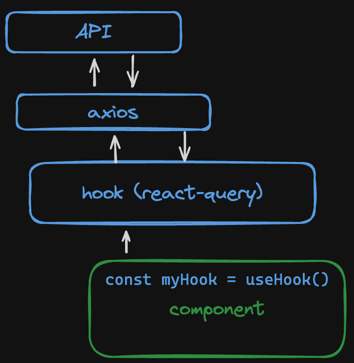

# Weekends

A simple airbnb style reservation system using React + Typescript + Vite.
This application allows the user to browse the available
inventory and book times. As inventory is booked
it should be removed from the listing page.
You should be able to filter listings using a start and end date
as well as the number of guests. Your bookings are listed on the trips `http://localhost:5173/trips/` page.

## Code

This application has a server and client. The server is a [json-server](https://www.npmjs.com/package/json-server)
application which serves up the `db.json` file containing the available inventory
and user created trips. The server runs on `localhost:3000`. The client code
is standard react + typescript leveraging [MUI](https://mui.com/) UI tools and runs on `http://localhost:5173/`

### React Query
This project leverages React Query as an async data caching layer. This enables cache refreshing during `PUT` and `POST` operations as well as optimistic updates.



There are three main pages to the UI. The listing page, `/`, the details page, `/asset-detail/<ID>` page and the trips page, `/trips/`.
Axios is leveraged at the API layer and the resulting data delivered via custom hooks to the react components.

## Tests
A few simple JEST tests are place holders as a template for building additional tests.

## Running
1. Start the server by running `yarn start` from the `/reserve-me/api/` directory
2. Start the client by running `yarn dev` from the root directory and point your browser to http://localhost:5173/


# React + TypeScript + Vite

This template provides a minimal setup to get React working in Vite with HMR and some ESLint rules.

Currently, two official plugins are available:

- [@vitejs/plugin-react](https://github.com/vitejs/vite-plugin-react/blob/main/packages/plugin-react/README.md) uses [Babel](https://babeljs.io/) for Fast Refresh
- [@vitejs/plugin-react-swc](https://github.com/vitejs/vite-plugin-react-swc) uses [SWC](https://swc.rs/) for Fast Refresh

## Expanding the ESLint configuration

If you are developing a production application, we recommend updating the configuration to enable type aware lint rules:

- Configure the top-level `parserOptions` property like this:

```js
export default {
  // other rules...
  parserOptions: {
    ecmaVersion: 'latest',
    sourceType: 'module',
    project: ['./tsconfig.json', './tsconfig.node.json'],
    tsconfigRootDir: __dirname,
  },
}
```

- Replace `plugin:@typescript-eslint/recommended` to `plugin:@typescript-eslint/recommended-type-checked` or `plugin:@typescript-eslint/strict-type-checked`
- Optionally add `plugin:@typescript-eslint/stylistic-type-checked`
- Install [eslint-plugin-react](https://github.com/jsx-eslint/eslint-plugin-react) and add `plugin:react/recommended` & `plugin:react/jsx-runtime` to the `extends` list
